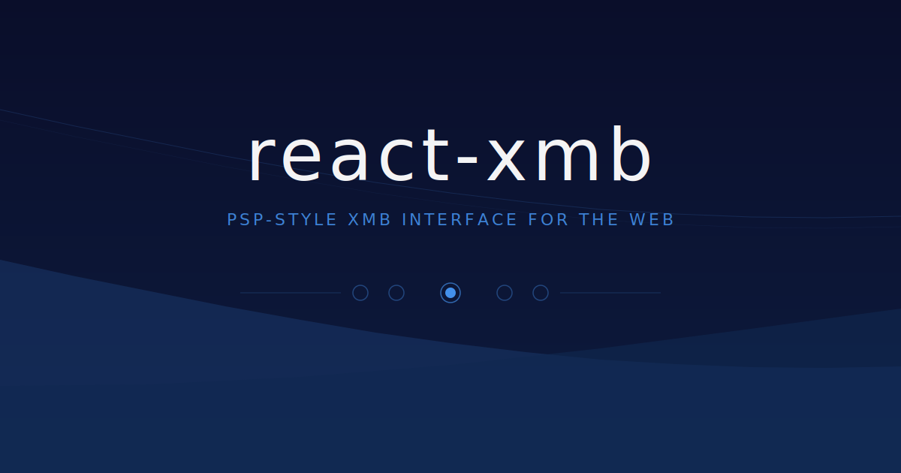

# react-xmb

A PSP-style Cross Media Bar (XMB) interface built with React + Vite. Fork it, edit one file, and make it your own.

## Features

- Animated wave background with surge on launch
- Per-item splash art backgrounds
- Markdown document viewer
- Image gallery with captions
- Audio and video media player
- WebGL and web app launcher with loading screen
- File download manager
- Glassmorphic side panel and overlays
- Boot screen animation
- Keyboard, touch, and `postMessage` controls

## Getting started

```bash
git clone https://github.com/kofolmarko/xmb-react
cd xmb-react
npm install
npm run dev
```

## Customisation

Everything is in **`src/manifest.jsx`** — categories, items, boot screen text. The file has a full schema reference at the top, and the running app has a Developer Guide under Settings.

```js
export const boot = {
  text: 'Your Name',
  subText: 'Press any key to start',
};
```

### Item types

| Type | Opens |
|------|-------|
| `document` | Markdown viewer |
| `gallery` | Image carousel |
| `application` | Audio / video / web / WebGL launcher |
| `download` | Download panel |
| `folder` | Nested sub-menu |

See `src/manifest.jsx` for the full field reference.

## Controls

| Key | Action |
|-----|--------|
| ← → Arrow keys | Switch categories |
| ↑ ↓ Arrow keys | Navigate items |
| Enter | Confirm / Open |
| Escape · Backspace | Back |
| T | Details panel |
| B | Cycle brightness |
| M | Mute |

Touch: swipe left/right to change category, swipe up/down to scroll, tap to confirm.

## Deployment

```bash
npm run build
```

Deploy the `dist/` folder to any static host (Vercel, Netlify, GitHub Pages).

## License

MIT — see [LICENSE](./LICENSE).
